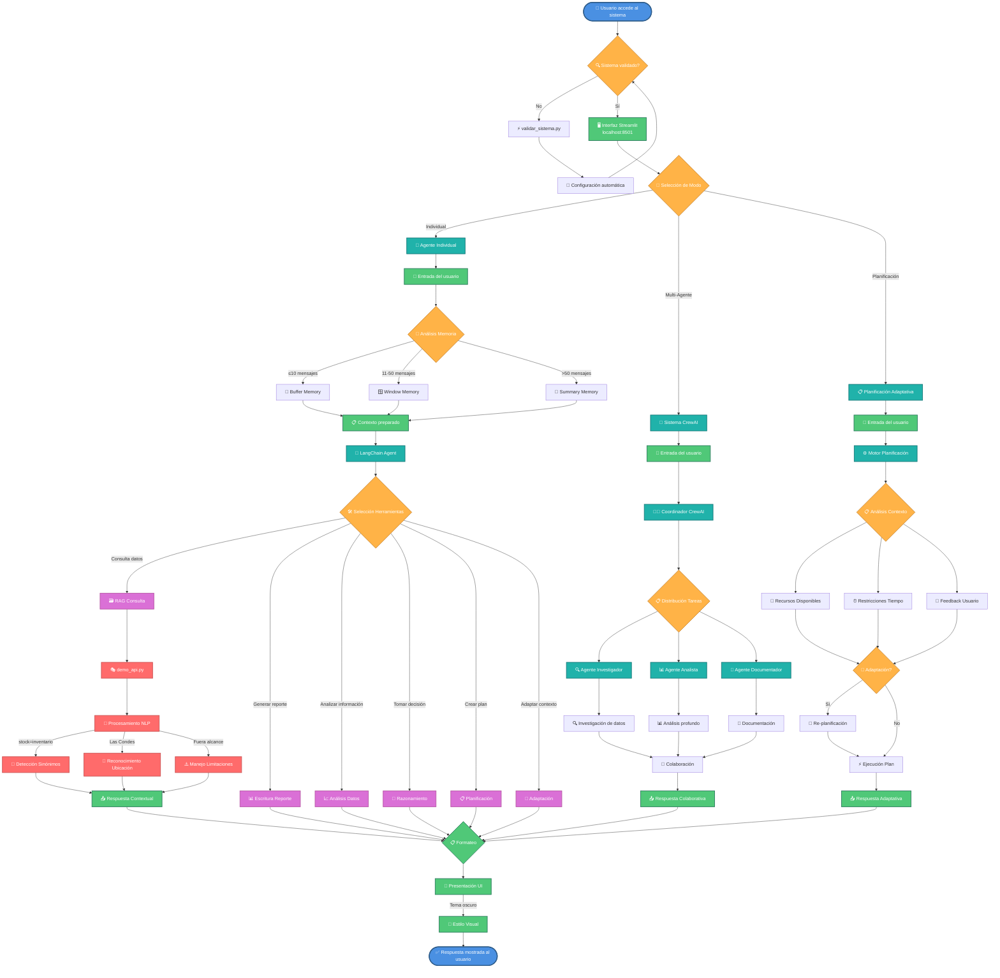
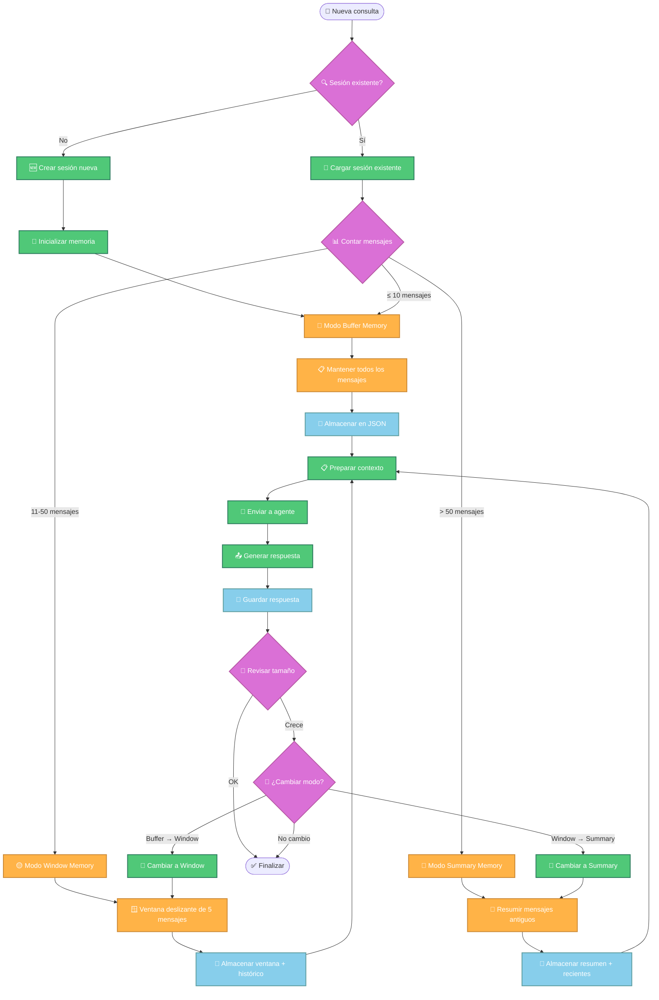
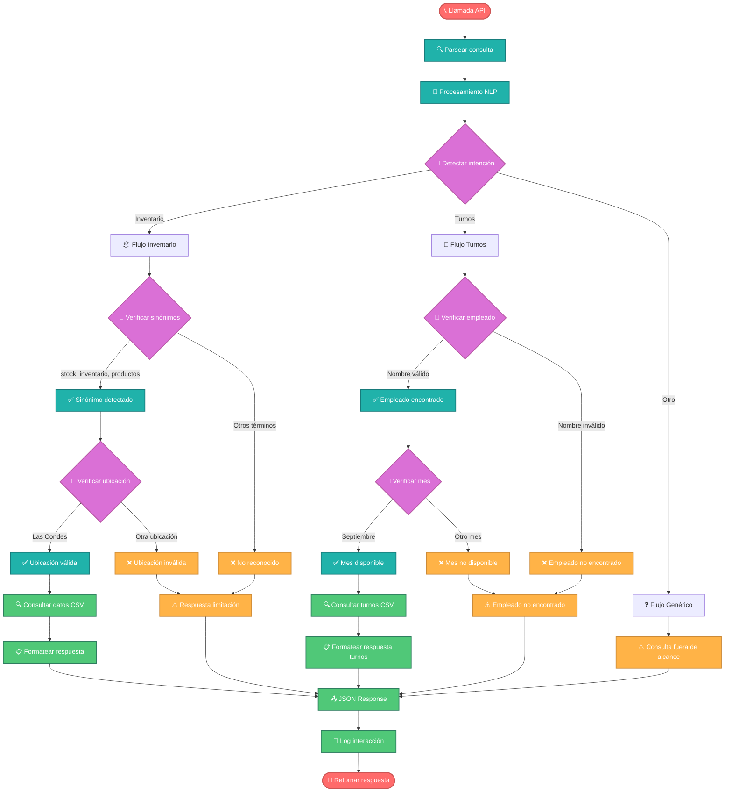
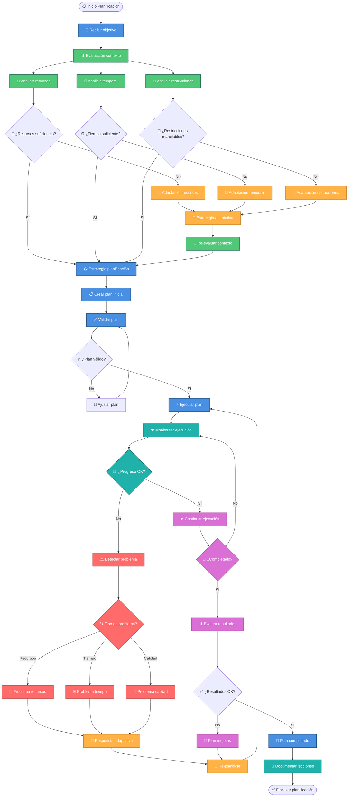

# 🔄 Diagramas de Flujo - Sistema CleanPro AI

Este documento contiene los diagramas de flujo detallados del sistema CleanPro AI, mostrando cómo interactúan todos los componentes desde la perspectiva del usuario hasta la generación de respuestas.

---

## 📊 Flujo Principal del Sistema



---

## 🧠 Flujo de Gestión de Memoria (IL2.2)



---

## 🎭 Flujo API Demo Inteligente



---

## 👥 Flujo CrewAI Multi-Agente (IL2.3)

```mermaid
flowchart TD
    CrewStart([🚀 Inicio CrewAI]) --> TaskReceive[📝 Recibir tarea]
    TaskReceive --> CrewCoordinator[👨‍💼 Coordinador de Crew]
    
    CrewCoordinator --> DefineRoles[🎭 Definir roles y responsabilidades]
    DefineRoles --> AssignTasks[📋 Asignar tareas específicas]
    
    AssignTasks --> ResearcherTask[🔍 Tarea: Investigación]
    AssignTasks --> AnalystTask[📊 Tarea: Análisis]
    AssignTasks --> WriterTask[📝 Tarea: Documentación]
    
    %% Agente Investigador
    ResearcherTask --> ResearchAgent[🔍 Agente Investigador]
    ResearchAgent --> DataGathering[📚 Recolección de datos]
    DataGathering --> SourceValidation[✅ Validación de fuentes]
    SourceValidation --> ResearchReport[📊 Reporte investigación]
    
    %% Agente Analista
    AnalystTask --> AnalystAgent[📊 Agente Analista]
    AnalystAgent --> DataAnalysis[🔬 Análisis de datos]
    DataAnalysis --> PatternRecognition[🔍 Reconocimiento patrones]
    PatternRecognition --> AnalysisReport[📈 Reporte análisis]
    
    %% Agente Documentador
    WriterTask --> WriterAgent[📝 Agente Documentador]
    WriterAgent --> ContentStructuring[📋 Estructuración contenido]
    ContentStructuring --> Documentation[📄 Documentación]
    Documentation --> QualityReview[✅ Revisión calidad]
    
    %% Colaboración entre agentes
    ResearchReport --> Collaboration[🤝 Espacio Colaboración]
    AnalysisReport --> Collaboration
    QualityReview --> Collaboration
    
    Collaboration --> KnowledgeSharing[🔄 Intercambio conocimiento]
    KnowledgeSharing --> ConflictResolution{⚖️ ¿Conflictos?}
    
    ConflictResolution --> |Sí| Mediation[🤝 Mediación]
    ConflictResolution --> |No| Integration[🔗 Integración resultados]
    
    Mediation --> Negotiation[💬 Negociación entre agentes]
    Negotiation --> Integration
    
    Integration --> QualityAssurance[🛡️ Aseguramiento calidad]
    QualityAssurance --> FinalValidation{✅ ¿Validación OK?}
    
    FinalValidation --> |No| Revision[🔄 Revisión y mejora]
    FinalValidation --> |Sí| CrewResult[🎯 Resultado final Crew]
    
    Revision --> KnowledgeSharing
    CrewResult --> DeliveryFormat[📦 Formato entrega]
    DeliveryFormat --> CrewEnd([✅ Entrega completada])
    
    %% Estilos
    classDef coordinator fill:#4A90E2,stroke:#2E5C8A,stroke-width:2px,color:#fff
    classDef researcher fill:#50C878,stroke:#2E7D5F,stroke-width:2px,color:#fff  
    classDef analyst fill:#FFB347,stroke:#CC8A37,stroke-width:2px,color:#fff
    classDef writer fill:#DA70D6,stroke:#B85AA6,stroke-width:2px,color:#fff
    classDef collaboration fill:#20B2AA,stroke:#177A7A,stroke-width:2px,color:#fff
    classDef quality fill:#FF6B6B,stroke:#CC5555,stroke-width:2px,color:#fff
    
    class CrewCoordinator,DefineRoles,AssignTasks coordinator
    class ResearcherTask,ResearchAgent,DataGathering,SourceValidation,ResearchReport researcher
    class AnalystTask,AnalystAgent,DataAnalysis,PatternRecognition,AnalysisReport analyst  
    class WriterTask,WriterAgent,ContentStructuring,Documentation,QualityReview writer
    class Collaboration,KnowledgeSharing,Mediation,Negotiation,Integration collaboration
    class QualityAssurance,FinalValidation,Revision,CrewResult,DeliveryFormat quality
```

---

## 📋 Flujo Planificación Adaptativa (IL2.3)



---

## 🎨 Leyenda de Colores

- 🔵 **Azul**: Puntos de inicio/fin y coordinación
- 🟢 **Verde**: Procesos y operaciones principales  
- 🟡 **Amarillo**: Decisiones y análisis
- 🟣 **Morado**: Herramientas y utilidades
- 🔴 **Rojo**: APIs y interfaces externas
- 🟦 **Azul Claro**: Agentes y componentes inteligentes

---

## 📝 Notas Técnicas

1. **Memoria Adaptativa**: El sistema cambia automáticamente entre Buffer, Window y Summary según el número de mensajes.
2. **API Inteligente**: El demo_api.py incluye procesamiento NLP para detectar sinónimos y ubicaciones.
3. **CrewAI Colaborativo**: Los agentes trabajan en conjunto con mediación automática de conflictos.
4. **Planificación Dinámica**: Se adapta a cambios en recursos, tiempo y restricciones en tiempo real.
5. **Validación Automática**: Scripts de testing validan todos los componentes antes de la ejecución.